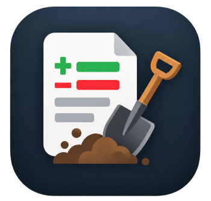
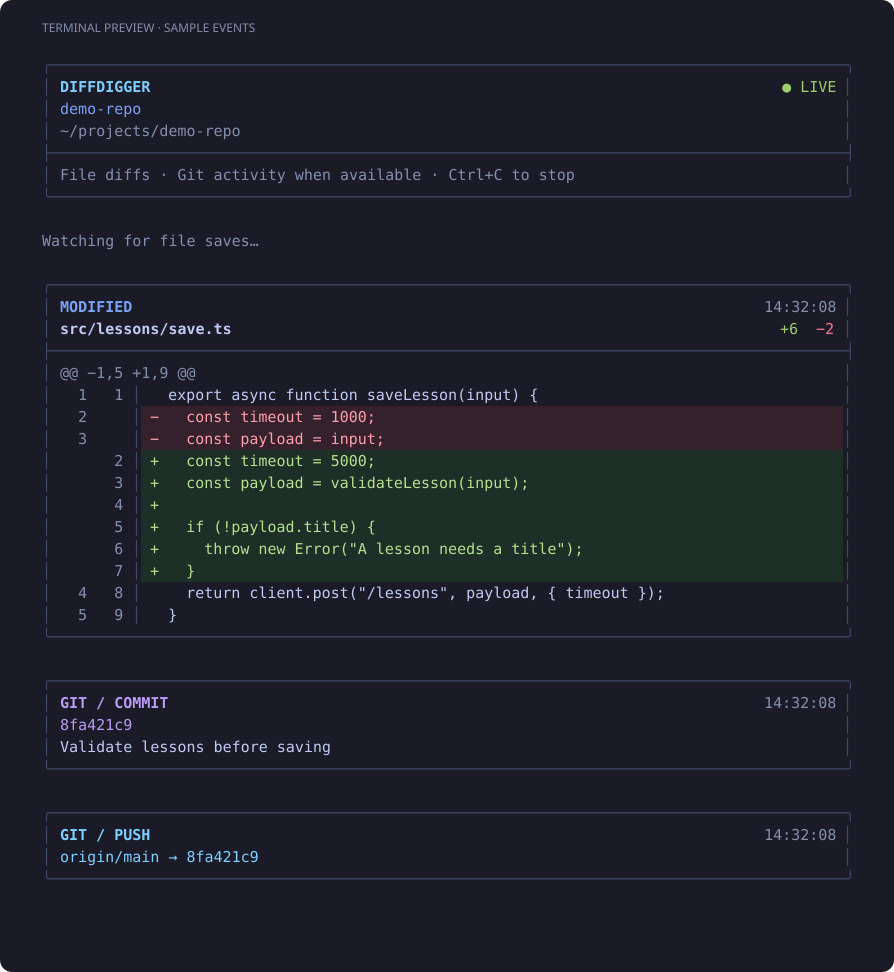

<p align="center">
  
</p>

<h1 align="center">Diffdigger</h1>

<p align="center"><strong>Watch code change as agents work.</strong></p>

Diffdigger streams saved file diffs from any directory into your terminal. Point
it at a folder, leave it running, and follow changes from agents, editors, or
scripts as they happen. Git activity appears alongside the diffs when available.



*Preview uses sample events.*

## Quick start

Requires **Python 3**. Git is optional: it adds commit/transfer events and Git
ignore filtering. Tested on Linux. The executable uses only the Python standard
library; there are no packages to install or services to start.

```bash
git clone https://github.com/peternickol/diffdigger.git
cd diffdigger
./diffdigger /path/to/folder
```

Use the path to any directory you want to watch. Press **Ctrl+C** to stop.
You can also download the `diffdigger` script directly and run it with
`python3 diffdigger /path/to/folder`; cloning the project is optional.

For example, watch your projects and the loose files alongside them:

```bash
./diffdigger ~/temp
```

Omit the path to watch your current directory and its subdirectories. No Git
repository, staging, or commits are required for file diffs.

## What you see

- **Saved changes:** created, modified, and deleted files, with additions and
  deletions shown as they are observed.
- **Readable diffs:** timestamps, old/new line numbers, change counts, surrounding
  context, and colored rows. Long lines wrap to fit the terminal.
- **Git activity:** commit, push, pull, and fetch events when Git leaves a local
  record that Diffdigger can detect.
- **Multiple projects:** one combined feed for plain folders and Git checkouts,
  with repository labels for nested repos and paths for other files.
- **A continuous feed:** earlier events stay in your terminal's scrollback.
  Staging and committing do not reset the file diff baseline.

## Usage

```text
diffdigger [--plain] [directory ...]
```

Run the executable by its path, or put it on your `PATH` to use `diffdigger`
from anywhere. With no directory argument, it uses the current directory.

```bash
# Watch any project folder
./diffdigger ~/projects/my-app

# Watch a few directories together
./diffdigger ~/projects/my-app ~/projects/api

# Watch everything under a parent folder
./diffdigger ~/temp

# Watch from the current directory (when diffdigger is on PATH)
diffdigger

# Use compact unified diffs without cards or colors
./diffdigger --plain /path/to/folder

# Keep the cards but disable colors
NO_COLOR=1 ./diffdigger /path/to/folder
```

Interactive terminals show cards across the full terminal width, adapting new
output when you resize the window. Redirected output and very narrow
terminals use a plain layout automatically. `--plain` disables both cards and
colors; `NO_COLOR=1` disables colors.

### Directory scope

Diffdigger walks the selected directory recursively. This includes loose files,
plain subfolders, and nested repositories or worktrees. New files and directories
are picked up automatically. Newly discovered repos also get Git monitoring
without a restart.

The path is the boundary: selecting a subdirectory of a repo watches files in
that subdirectory, without expanding to the entire checkout. Git activity, when
available, still describes the containing repository.

You can pass several directories. Duplicate and overlapping paths are watched
once. Nested repo events use the repo's folder name; if names collide, they show
full paths. If one explicitly watched directory becomes unavailable, Diffdigger
reports it and retries while continuing to watch the other selected directories.

## How the live feed works

At startup, Diffdigger takes a snapshot of the selected directories' current files.
It immediately shows baseline progress with the current path, file count, and
elapsed time, then reports the final file and Git repo counts before going live.
Progress updates stay on stderr; interactive terminals update one line, while
`--plain` and redirected stderr use occasional text lines.

It checks them in turn, then waits half a second between polling rounds.
Each changed file is compared with its previously observed contents. Existing
uncommitted changes become the starting baseline; they are not replayed when you
launch it. More or larger directories can make a polling round take longer.

This lets you follow work before it reaches a commit. Only saved changes appear,
and several saves between checks may appear as a single diff.

The filesystem supplies the file list, and Python computes the diffs. Git is
never required for that process. When available in a repo, Git supplies ignore
rules so ignored untracked files stay out of the feed; tracked files still appear.
If Git is missing or its ignore query fails, regular files are watched without
Git ignore filtering. Plain folders do not interpret `.gitignore` files.

Symlinks and `.git` metadata are always skipped. Diffdigger keeps its baseline in
memory and does not modify files, install hooks, or change Git configuration.

## Git activity

Git events are optional. Diffdigger reads new entries in local
reflog files and watches `FETCH_HEAD`; it does not contact remotes or replay old
commits. Git errors do not stop file diffs. For a newly discovered repository,
Git monitoring starts from its current records rather than replaying its history.

| Event | What triggers it |
| --- | --- |
| **COMMIT** | A new commit entry in the checkout's HEAD reflog. |
| **PUSH** | A remote-tracking reflog records an update by push. |
| **PULL** | A HEAD or remote-tracking reflog records a pull. |
| **FETCH** | A remote-tracking reflog records a fetch. |
| **FETCH/PULL activity** | `FETCH_HEAD` changes without a corresponding fetch or pull reflog event in that check. |

`FETCH_HEAD` alone cannot distinguish a fetch from a pull or prove the command
succeeded. Failed or up-to-date pushes, and other operations that leave no
applicable local record, are not visible. Git activity detection relies on
file-based reflogs; repositories with reflogs disabled or reftable storage will
have limited coverage. Linked worktrees share remote-tracking records, so a
fetch or push may appear under more than one watched worktree. This feed is not
a complete command history.

## Current limits

- Skips symlinks and `.git` metadata. Checked-out submodule files are watched
  like other nested directories.
- Reports a change summary for binary/non-UTF-8 files and files larger than
  1 MiB, without a text diff.
- Shows renames as a deletion and a creation.
- Observes saved file changes; it cannot identify which agent or process made them.

## Development

The watcher and terminal renderer live in [`diffdigger`](diffdigger). Tests use
temporary repositories and local remotes, with no network access needed.

```bash
python3 -m unittest -v
```

To regenerate the sample terminal preview from the renderer:

```bash
python3 tools/preview.py
```

The generated image is [`docs/terminal.svg`](docs/terminal.svg).

## License

[MIT](LICENSE) — Copyright (c) 2026 Peter Nickol.
